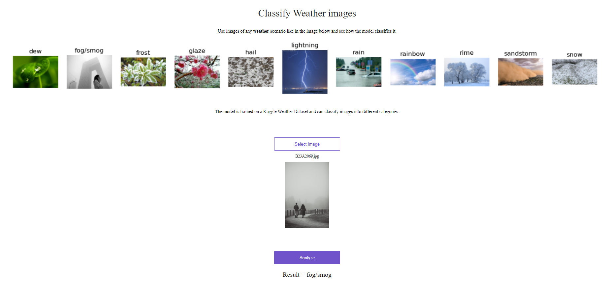

# Weather Classification Webapp




This project will help you discern the type of weather seen in the image. Upload the image and the model will classify the image as depicting one of these weather scenarios:
dew, fog/smog, frost, glaze, hail, lightning, rain, rainbow, rime, sandstorm, snow

<!-- TABLE OF CONTENTS -->
## Table of Contents

* [Introduction](#Introduction)
* [Definitions](#Definitions)
* [Project Structure](#Project-Structure)
* [Getting Started](#Getting-Started)
    * [Prerequisites](#Prerequisites)
    * [Installation](#Installation)
* [Train the Model](#training-the-model)
* [Flask App Setup](#flask-app)
* [Dockerizing the Flask App](#dockerizing-the-flask-app)
* [Testing WebApp Locally](#test-the-webapp-locally)
* [Deployment to Heroku](#deploy-containerized-ml-model-with-flask-to-heroku)
* [Usage](#usage)
* [Contact](#contact)

## Introduction
This project focuses on classifying images into various weather categories like rain, fog, dew, etc., using transfer learning with the MobileNetV2 model in TensorFlow. The model is converted to TensorFlow Lite (TFLite) format for efficient inference. A Flask web application serves the model, which is containerized using Docker and deployed on Heroku.

### Definitions
Definitions of different weather conditions from [Weather.org](https://forecast.weather.gov/glossary.php?word=fog):
- Dew -
Moisture that has condensed on objects near the ground, whose temperatures have fallen below the dewpoint temperature.
- Fog -
(abbrev. F) Fog is water droplets suspended in the air at the Earth's surface. Fog is often hazardous when the visibility is reduced to ¼ mile or less.

- Smog -
Originally smog meant a mixture of smoke and fog. Now, it means air that has restricted visibility due to pollution or pollution formed in the presence of sunlight--photochemical smog.

- Frost -
(Abbrev. FRST) - Frost describes the formation of thin ice crystals on the ground or other surfaces in the form of scales, needles, feathers, or fans. Frost develops under conditions similar to dew, except the temperatures of the Earth's surface and earthbound objects falls below 32°F. As with the term "freeze," this condition is primarily significant during the growing season. If a frost period is sufficiently severe to end the growing season or delay its beginning, it is commonly referred to as a "killing frost." Because frost is primarily an event that occurs as the result of radiational cooling, it frequently occurs with a thermometer level temperature in the mid-30s.

- Glaze -
Ice formed by freezing precipitation covering the ground or exposed objects.

- Hail -
Showery precipitation in the form of irregular pellets or balls of ice more than 5 mm in diameter, falling from a cumulonimbus cloud.

- Lightning - 
(abbrev. LTNG) A visible electrical discharge produced by a thunderstorm. The discharge may occur within or between clouds, between the cloud and air, between a cloud and the ground or between the ground and a cloud.

- Rain - 
Precipitation that falls to earth in drops more than 0.5 mm in diameter. 

- Rainbow - 
A luminous arc featuring all colors of the visible light spectrum (red, orange, yellow, green, blue, indigo, and violet). It is created by refraction, total reflection, and the dispersion of light. It is visible when the sun is shining through air containing water spray or raindrops, which occurs during or immediately after a rain shower. The bow is always observed in the opposite side of the sky from the sun.


- Rime - An opaque coating of tiny, white, granular ice particles caused by the rapid freezing of supercooled water droplets on impact with an object. 

- Sandstorm - 
Particles of sand carried aloft by strong wind. The sand particles are mostly confined to the lowest ten feet, and rarely rise more than fifty feet above the ground.

- Snow -
Precipitation in the form of ice crystals, mainly of intricately branched, hexagonal form and often agglomerated into snowflakes, formed directly from the freezing [deposition] of the water vapor in the air.


## Project Structure
```
weather-classification_dl/
├── Dockerfile                      # Dockerfile for container setup
├── LICENSE
├── MobileNetv2.keras               # Keras model
├── MobileNetv2.tflite              # Converted TensorFlow Lite model
├── Pipfile                         # Environment setup for development
├── Pipfile.lock
├── Procfile                        # Heroku 
├── README.md                       # Project documentation
├── __pycache__│   
├── assets
│   ├── tflite_runtime-2.14.0-cp39-cp39-manylinux2014_x86_64.whl
│   ├── weather_classes.png
│   └── webapp_screenshot.png
├── data                            # data folder should look like this
│   ├── dew
│   ├── fogsmog
│   ├── frost
│   ├── glaze
│   ├── hail
│   ├── lightning
│   ├── rain
│   ├── rainbow
│   ├── rime
│   ├── sandstorm
│   └── snow
├── convert_to_tflite.py            # model conversion to tflite
├── environment.yml
├── predict.py                      # Main Flask application file
├── predict_test.py                 # Test api
├── requirements.txt
├── static
│   ├── client.js                   # JavaScript files
│   ├── style.css                   # CSS styles
│   └── weather_classes.png
├── templates
│   └── index.html                  # Main webpage template
├── train.py                    # Final model experimentation and training
├── weather_data_prepare.py
├── weather_eda_modeling.ipynb       # Jupyter notebook for model training
├── weather_tflite_model_check.ipynb # tflite model testing
└── xception_v3_28_0.825.h5

```
## Getting Started

### Prerequisites

- Python
    ```Python 3.9.13 ```    
- flask
- Pillow
- Docker
- tflite-runtime (inference)
- Tensorflow (for development) ```tensorflow = "==2.14"```

### Installation

1. Clone the Repository:
   ```bash
   git clone https://github.com/yourusername/weather-classification_dl.git
   cd weather-classification_dl

2. Set Up a Virtual Environment (Optional):
    1. Install Pipenv:
    If you don't have Pipenv installed, you can install it globally with pip:
    ```bash
    pip install pipenv
    ```
    2. Initialize the Environment:
    Use Pipenv to create a virtual environment for the project. Pipenv will automatically use the 'Pipfile' in your project folder if it is present and install the dependencies.
    ```bash
    pipenv install
    ```

    If your Pipfile becomes out of sync with pipfile.lock at any point because of additional installations, you can use 
    ```bash
    pipenv lock
    ```
    and the lock file would be regenerated.

    3. Activate the Virtual Environment:
    To activate the virtual environment and start working on the project, use:
    ```bash
    pipenv shell
    ```

    ## Training the Model
    1. Prepare Data:
        Data can be downloaded directly from kaggle:
        [Link to Kaggle Dataset](https://www.kaggle.com/datasets/jehanbhathena/weather-dataset/download?datasetVersionNumber=3)

        or use Kaggle API to download and place the image folders in the data folder using command below:

        ```bash
        kaggle datasets download -d jehanbhathena/weather-dataset -p data/ --unzip
        ```

    2. Train the Model:
        Multiple models were tested for the multi-classification problem in the project. Some initial experimentation is done in weather_eda_modeling.ipynb notebook. In train.py, we run through different models to compare them and also to save the final model.

        Some models compared:
        - EfficientNetB7
        - Resnet50
        - MobileNet
        - MobileNetv2
        - VGG19
        - Xception

        In the end, a model with MobileNetv2 was saved since it had good performance and fewer parameters making it a lighter choice.

    3. Convert to TFLite:
        We convert the .keras model to .tflite in convert_to_tflite.py so that we can use a light model for inference. The memory on disk goes from about 15MB to 13MB after the conversion. Having a tflite model definitely helps later during deployment where our slugsize can make the difference between too big a model vs just-right-to-fit.


## Flask App
1. Setup App
    predict.py is the flask app that will be used. There are few dependencies there.
2. Setup support files
    - Static folder - client.js and style.css files will be used by the app for UI
    - templates folder - index.html will be the frontend HTML file that we'll use as UI for the user.

Starting Flask Server:
```bash
 flask --app predict run
 ```

## Dockerizing the Flask App

1. Build the Docker Image:
```
docker build --pull --rm -f "Dockerfile" -t weatherclassificationdl:v1 "." 
```

2. Run the Docker Container:
```
docker run --rm -d -p 5000:5000/tcp weatherclassificationdl:v1 
```

## Test the WebApp locally

After running the docker container, we can open the browser and use the app by going to:
```bash
localhost:5000
```

## Deploy containerized ML model with Flask to Heroku

To check out the app, go to:

[Heroku Weather Classification WebApp](https://weather-classifier-7578afa1814c.herokuapp.com/)


I may turn it off in a week or so after 1/1/2024. If you would like to use it, send me a request by email and I will turn it back on.

To deploy to your own app:

1. Login to Heroku
2. Create a Heroku App
3. Deploy the container (you may use the github option, which is straightforward)

## Usage

Once the app is up and working, the user can test it by uploading an appropriate image and clicking the Analzye button. It will then show the prediction at the bottom as seen in above screenshot. That's it!

<!-- CONTACT -->
## Contact

[Email me](gkumarg@gmail.com): Gopakumar Gopinathan 

Add me on [LinkedIn](https://www.linkedin.com/in/ggopinathan/)

